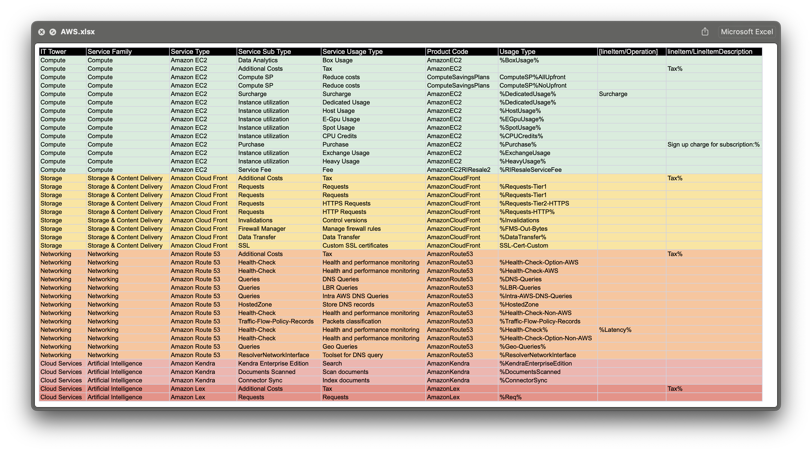

# Лабораторная работа 2. Сравнение сервисов Amazon Web Services и Microsoft Azure. Создание единой кросс-провайдерной сервисной модели.

## Цель работы
Получение навыков аналитики и понимания спектра публичных облачных сервисов без привязки к вендору. Формирование у студентов комплексного видения Облака. 

## Дано
1. Данные лабораторной работы 1.
2. Слепок данных биллинга от провайдера после небольшой обработки в виде SQL-параметров. Символ % в начале/конце означает, что перед/после него может стоять любой набор символов.
3. Образец итогового соответствия, что желательно получить в конце. В этом же документе  

## Необходимо
1. Импортировать файл .csv в Excel или любую другую программу работы с таблицами. Для Excel делается на вкладке Данные – Из текстового / csv файла – выбрать файл, разделитель – точка с запятой.
2. Распределить потребление сервисов по иерархии, чтобы можно было провести анализ от большего к меньшему (напр. От всех вычислительных ресурсов Compute дойти до конкретного типа использования - выделенной стойка в датацентре Dedicated host usage).
3. Сохранить файл и залить в соответствующую папку на Google Drive.

## Алгоритм работы
Сопоставить входящие данные от провайдера с его же документацией. Написать в соответствие колонкам справа значения 5 колонок слева, которые бы однозначно классифицировали тип сервиса. Для столбцов IT Tower и Service Family значения можно выбрать из образца. В ходе выполнения работы не отходить от принципов классификации, выбранных в Лабораторной работе 1.

# rabota🦅

Для начала пришлось покопаться че к чему, а в случае с AWS ниче не к чему и все подряд. Ну ничего страшного, таблица дала мне понимание куда плыть, и началось копание инфы про сервисы авс. Вот че мне попалось!

### Azure AI - анализ/обработка данных
### Azure Container Instances - развертывание аппов в контейнерах в облаке без vm
### Azure Container Registry - реестр контейнеров для управления образами
### Azure Data Box - безопасная передача больших объемов данных в облако
### Azure Data Lake - масштабируемое хранилище данных
### Azure Machine Learning - ну работа с мл (обучение, развертка моделей)
### Azure Network Watcher - мониторинг, диагностика и анализ сетевой инфры
### Azure SQL - облачные БД + генерации отчетности. Предлагает управляемые SQL-сервисы
### Azure Virtual Network - взаимодействие с сетью и ресурсами ажура

## Что
Дальше выбрал для каждого Service Family и IT Tower из примера, заполнил Service Type, как показано в примере. ну и цветами разделил чтоб наглядно было видно

### swag

## Вывод
Пришлось скачать эксель (не думал что после еге им придется пользоваться). Покопался в джеф безос. Заблудился в aws. Ну прикольно в целом