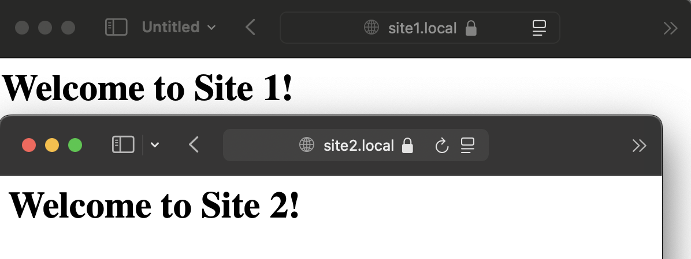

# NGINX

## Начало
Чтобы начать, надо зайти в приложение TERMINAL и написать там команду смешную (если у вас макбук, а если нет, то хахахаахах)
`brew install nginx`

## Потом надо создать сами сайтики:
```sh
sudo mkdir -p /opt/homebrew/var/www/site1
sudo mkdir -p /opt/homebrew/etc/nginx/ssl/site1
```
и так же со вторым.

## Затем надо сертификаты:
```sh
sudo openssl req -x509 -nodes -days 567 -newkey rsa:2048 \
-keyout /opt/homebrew/etc/nginx/ssl/site1/privkey.pem \
-out /opt/homebrew/etc/nginx/ssl/site1/fullchain.pem
```

## Дальше проблемы:
Хорошо идем, но могут возникнуть `permission_denied!!!!` и это может сильно ОБИДЕТЬ.
Но слава богу я проходил курс информатики в университете ITMO и помню что есть такие смешные штуки, как CHMOD RWXRWXRXWRXRWXXWR
И вот крутое решение:
```sh
sudo chmod 644 /opt/homebrew/etc/nginx/ssl/site1/fullchain.pem
sudo chmod 644 /opt/homebrew/etc/nginx/ssl/site1/privkey.pem
sudo chown $(whoami):admin /opt/homebrew/etc/nginx/ssl/site1/*
```

## Вернемся к NGINKS

Надо `nginx.conf` файл тоже написать нормально, а то не заведется (находится к /opt/homebrew/etc/nginx/, ну а если вы на WINDOWS то грустно)!
Вот как я сделал, смотрите внимательно:
```swift
worker_processes  1;
pid /opt/homebrew/var/run/nginx.pid;

events {
    worker_connections  1024;
}

http {
    include       mime.types;
    default_type  application/octet-stream;

    access_log /opt/homebrew/var/log/nginx/access.log;
    error_log /opt/homebrew/var/log/nginx/error.log;

    sendfile        on;
    keepalive_timeout  65;

    include /opt/homebrew/etc/nginx/sites-enabled/*;
}
```

## Проверяем чтобы норм было:
1. Проверяем работу нгинкс `ps aux | grep nginx`
2. Проверяем правильные ли он слушает порты: `sudo lsof -i :80`, `sudo lsof -i :443`

Ну и вот, что из этого вышло!
```sh
mi11ion@mi11ionair ~ % ps aux | grep nginx
mi11ion          23485   0.0  0.0 410733328   1568 s000  R+    7:09PM   0:00.00 grep nginx
mi11ion          23479   0.0  0.0 410890384   2048   ??  S     7:09PM   0:00.00 nginx: worker process  
mi11ion          23476   0.0  0.1 410890384   6864   ??  S     7:09PM   0:00.03 nginx: master process /opt/homebrew/opt/nginx/bin/nginx -g daemon off;

mi11ion@mi11ionair ~ % sudo lsof -i :80
Password:
COMMAND   PID    USER   FD   TYPE             DEVICE SIZE/OFF NODE NAME
nginx   23476 mi11ion    6u  IPv4 0x199731832e999794      0t0  TCP *:http (LISTEN)
nginx   23479 mi11ion    6u  IPv4 0x199731832e999794      0t0  TCP *:http (LISTEN)

mi11ion@mi11ionair ~ % sudo lsof -i :443
COMMAND     PID    USER   FD   TYPE             DEVICE SIZE/OFF NODE NAME
Telegram  17696 mi11ion   55u  IPv4 0x7c2064c220d76ca2      0t0  TCP 100.117.38.146:54854->149.154.167.41:https (ESTABLISHED)
Telegram  17696 mi11ion   57u  IPv4 0xea7fd63832df3e20      0t0  TCP 100.117.38.146:54855->149.154.167.41:https (ESTABLISHED)
PacketTun 21483 mi11ion   17u  IPv4 0xac5701c072364fdf      0t0  TCP 100.117.38.146:56554->de1.gofizz.in:https (ESTABLISHED)
PacketTun 21483 mi11ion   24u  IPv4 0xe6ae9c04ec3a1e57      0t0  TCP 100.117.38.146:57275->de1.gofizz.in:https (ESTABLISHED)
PacketTun 21483 mi11ion   37u  IPv4 0x8f467cef9547d58a      0t0  TCP 100.117.38.146:57245->de1.gofizz.in:https (ESTABLISHED)
PacketTun 21483 mi11ion   42u  IPv4 0xe54d5933acef239e      0t0  TCP 100.117.38.146:57247->de1.gofizz.in:https (ESTABLISHED)
PacketTun 21483 mi11ion   89u  IPv4 0x117ac8b4ad52182e      0t0  TCP 100.117.38.146:56667->de1.gofizz.in:https (ESTABLISHED)
nginx     23476 mi11ion    7u  IPv4 0x35d35460c7a7c251      0t0  TCP *:https (LISTEN)
nginx     23479 mi11ion    7u  IPv4 0x35d35460c7a7c251      0t0  TCP *:https (LISTEN)
```

Как мы видим, все топово.

## Реально работает?
А теперь надо зайти на наши сайтики, проверить все ли так!
При заходе на site1.local или site2.local происходит переадрессация на https, что хорошо, но сафари ругается (не смог повторно воспроизвести для скрина, ну вы поняли)

А ругается потому что у нас самописный серт, так что не волнуемся и идем дальше :D

И вот у нас все работает!



# Заключение
Прикольно, научился локально запускать сайтики с `nginxом`. Вспомнил базы первого семестра и впосмнил как работать с `markdown`.
крутая лаба