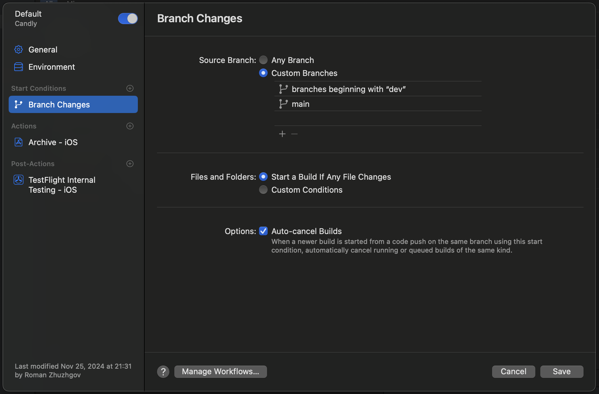
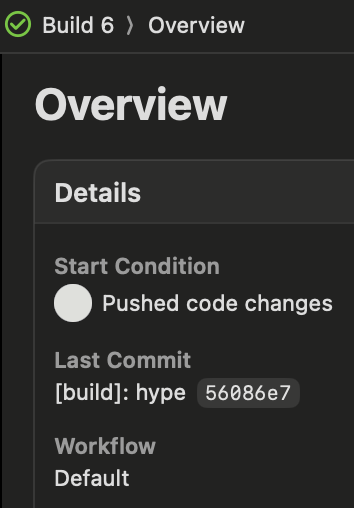

# Good/bad practices with CI/CD :333
## Плохой воркфлоу:

Начнем с bad practices, которые часто можно найти по всему гитхабу:
```yml
name: Bad CI/CD

on: push

jobs:
  build-and-deploy:
    runs-on: ubuntu-latest
    
    steps:
      - uses: actions/checkout@v2
      
      - name: Install dependencies
        run: |
          npm install
          npm install -g some-package
          
      - name: Run tests
        run: npm test
        
      - name: Build
        run: |
          npm run build
          echo ${{ secrets.DB_PASSWORD }}
          
      - name: Deploy to production
        if: github.ref == 'refs/heads/master'
        run: |
          echo "Deploying to production..."
          scp -r dist/* user@production-server:/var/www/
          
      - name: Cleanup
        run: |
          rm -rf node_modules/
          rm -rf dist/
```
А что не так спросите вы!

## Проблемы
### Первая - неограниченные триггеры
Как мы можем заметить, в файле есть триггер `on: push`, а это пакость и гадость
Почему? Представьте себе временные ветки, где вам не потребуются лишние сборки, но все ранво будут исполняться, что приведет к трате РЕСУРСОВ, что деньги (ну и безопасность блаблабла)

Ну все же ничего плохого в этом нет, просто необходимо явно указать ветки, при изменениях на которых и будет исполняться воркфлоу:
```yml
on:
  push:
    branches: [ main, develop ]
  pull_request:
    branches: [ main ]
```

На личном примере, вот у меня есть воркфлоу Xcode Cloud, который при изменениях делает сборку и выгружает на тестироание. Удобно? Очень! Однако, все равно надо настроить и указать, с какими ветками оно будет исполняться автоматически, ведь ресурсы у меня ограничены:





### Вторая - отсутствие разделения на jobs
Что не так:
Все шаги выполняются в одном `job build-and-deploy`. А из-за этого отладка усложняется и нет async выполнения -> долго -> дорого

Как исправить:
```yml
jobs:
  test:
    runs-on: ubuntu-latest
    steps:

  build:
    needs: test
    runs-on: ubuntu-latest
    steps:

  deploy:
    needs: build
    runs-on: ubuntu-latest
    steps:
```
Вот мы разделили тест билд и сборку, чтобы не делать все подряд каждый раз!

### Третья - небезопасная работа с секретами
Мы прямо выводим секреты в логи - `echo ${{ secrets.DB_PASSWORD }}`
ТАК НЕЛЬЗЯ!

Вот как надо:
```yml
- name: Configure credentials
  uses: aws-actions/configure-aws-credentials@v1
  with:
    aws-access-key-id: ${{ secrets.AWS_ACCESS_KEY_ID }}
    aws-secret-access-key: ${{ secrets.AWS_SECRET_ACCESS_KEY }}
    aws-region: us-east-1
```
Так секрет используется безопасно и не будет утечек в логах

### Четвертая - нестабильная установка зависимостей
Мы используем просто `npm install`, а ведь так не круто. Это модет привести к разным версиям пакетов.
А еще ниже мы пишем `npm install -g some-package`. Глобальная установка создает проблемы с воспроизводимостью!

А вот как исправить:
```yml
- name: Setup Node.js
  uses: actions/setup-node@v3
  with:
    node-version: '18'
    cache: 'npm'
    
- name: Install dependencies
  run: npm ci
```
В итоге у нас воспроизводимые сборки, зависимости кешируются и есть точное соответствие `package-lock.json`

### Пятая - небезопасный деплой
У нас прямо используется SCP, что небезопасно и не предоставляет механизмов отката.
```yml
scp -r dist/* user@production-server:/var/www/
```
А лучше так:
```yml
- name: Deploy to S3
  run: |
    aws s3 sync dist/ s3://${{ secrets.PRODUCTION_BUCKET }}/
```
Так мы добились безопасного процесса деплоя, возможность отката и логирование изменений

## Хороший воркфлоу:
А если применить все вышеперечисленные советы, то вот что получится:
```yml
name: Good CI/CD

on:
  push:
    branches: [ main, develop ]
  pull_request:
    branches: [ main ]

jobs:
  test:
    runs-on: ubuntu-latest
    timeout-minutes: 30
    
    steps:
      - uses: actions/checkout@v3
      
      - name: Setup Node.js
        uses: actions/setup-node@v3
        with:
          node-version: '18'
          cache: 'npm'
          
      - name: Install dependencies
        run: npm ci
        
      - name: Run linter
        run: npm run lint
        
      - name: Run tests
        run: npm run test
        
      - name: Upload test coverage
        uses: actions/upload-artifact@v3
        with:
          name: coverage
          path: coverage/
          
  build:
    needs: test
    runs-on: ubuntu-latest
    if: github.event_name == 'push'
    
    steps:
      - uses: actions/checkout@v3
      
      - name: Setup Node.js
        uses: actions/setup-node@v3
        with:
          node-version: '18'
          cache: 'npm'
          
      - name: Install dependencies
        run: npm ci
        
      - name: Build
        run: npm run build
        
      - name: Upload build artifacts
        uses: actions/upload-artifact@v3
        with:
          name: dist
          path: dist/
          
  deploy:
    needs: build
    runs-on: ubuntu-latest
    if: github.ref == 'refs/heads/main' && github.event_name == 'push'
    environment: production
    
    steps:
      - name: Download build artifacts
        uses: actions/download-artifact@v3
        with:
          name: dist
          
      - name: Configure AWS credentials
        uses: aws-actions/configure-aws-credentials@v1
        with:
          aws-access-key-id: ${{ secrets.AWS_ACCESS_KEY_ID }}
          aws-secret-access-key: ${{ secrets.AWS_SECRET_ACCESS_KEY }}
          aws-region: us-east-1
          
      - name: Deploy to S3
        run: |
          aws s3 sync dist/ s3://${{ secrets.PRODUCTION_BUCKET }}/
```

## Secrets🌟✨🤩
Хранить секреты прямо в переменных в пайплайне это плохо, но почему?
Вот много причин почему:
1. Нет детальных политик доступа
2. Сложно управлять правами для разных команд
3. Отсутствует механизм временного доступа
4. Нет логирования доступа к секретам
5. Сложно отследить использование
6. Нет уведомлений о подозрительной активности
7. Нет автоматической ротации секретов
8. Секреты могут попасть в логи
9. Отсутствует шифрование

## Интегрируем с HashiCorp Vault (BONUS 😜)
Чтобы все было безопасно и прикольно, можем использовать ХИТ под названием Hashicorp Vault:
```yml
jobs:
  deploy:
    steps:
      - name: Install Vault CLI
        run: |
          curl -fsSL https://apt.releases.hashicorp.com/gpg | sudo apt-key add -
          sudo apt-add-repository "deb [arch=amd64] https://apt.releases.hashicorp.com $(lsb_release -cs) main"
          sudo apt-get update && sudo apt-get install vault

      - name: Authenticate with Vault
        run: |
          export VAULT_ADDR='https://vault.company.com'
          vault login -method=jwt role=ci jwt=${{ secrets.VAULT_JWT }}
          
      - name: Get secrets
        run: |
          AWS_CREDS=$(vault read -format=json aws/creds/deploy-role)
          export AWS_ACCESS_KEY_ID=$(echo $AWS_CREDS | jq -r .data.access_key)
          export AWS_SECRET_ACCESS_KEY=$(echo $AWS_CREDS | jq -r .data.secret_key)
          
          aws s3 sync dist/ s3://${PRODUCTION_BUCKET}/
```

Но как он нам поможет? Ну он дает нам кучу удобных фич, чтобы решить ранее перечисленные проблемы!
1. Есть временные credentials
2. Есть автоматический отзыв доступа
3. Дает нам историю использования, кто и когда получал доступ
4. Регулярно обновляет секреты секретики
5. Интегрируем с внешними системами

Ну и киллер фича это - отсутствие человеческого фактора

# Заключение
Освежил знания про сиайсиди, узнал как работать с секретами с помощью hashicorp. в целом норм лаба, но прошлая покруче